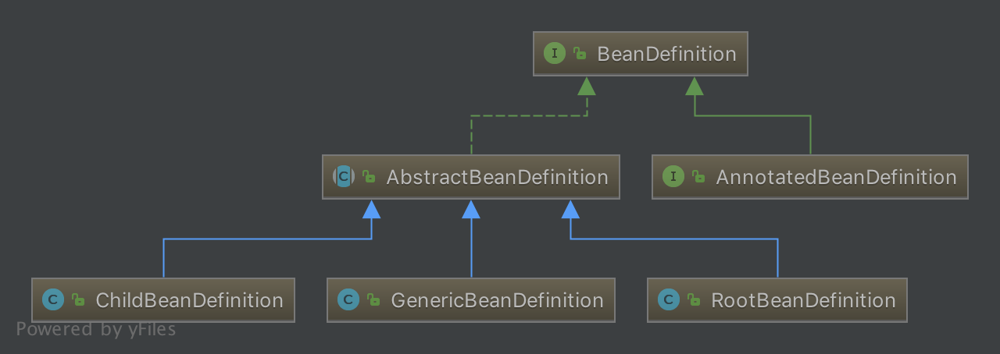

解析 bean 标签的过程其实就是构造一个 BeanDefinition 对象的过程。`<bean>` 元素标签拥有的配置属性，BeanDefinition 均提供了相应的属性，与之一一对应。所以，我们有必要对 BeanDefinition 先有一个整体的认识。

## 1. BeanDefinition
`org.springframework.beans.factory.config.BeanDefinition` ，是一个接口，它描述了一个 Bean 实例的定义，包括属性值、构造方法值和继承自它的类的更多信息。代码如下：

```java
String SCOPE_SINGLETON = ConfigurableBeanFactory.SCOPE_SINGLETON;
String SCOPE_PROTOTYPE = ConfigurableBeanFactory.SCOPE_PROTOTYPE;


int ROLE_APPLICATION = 0;
int ROLE_SUPPORT = 1;
int ROLE_INFRASTRUCTURE = 2;

void setParentName(@Nullable String parentName);
@Nullable
String getParentName();

void setBeanClassName(@Nullable String beanClassName);
@Nullable
String getBeanClassName();

void setScope(@Nullable String scope);
@Nullable
String getScope();

void setLazyInit(boolean lazyInit);
boolean isLazyInit();

void setDependsOn(@Nullable String... dependsOn);
@Nullable
String[] getDependsOn();

void setAutowireCandidate(boolean autowireCandidate);
boolean isAutowireCandidate();

void setPrimary(boolean primary);
boolean isPrimary();

void setFactoryBeanName(@Nullable String factoryBeanName);
@Nullable
String getFactoryBeanName();

void setFactoryMethodName(@Nullable String factoryMethodName);
@Nullable
String getFactoryMethodName();

ConstructorArgumentValues getConstructorArgumentValues();
default boolean hasConstructorArgumentValues() {
	return !getConstructorArgumentValues().isEmpty();
}

MutablePropertyValues getPropertyValues();
default boolean hasPropertyValues() {
	return !getPropertyValues().isEmpty();
}

void setInitMethodName(@Nullable String initMethodName);
@Nullable
String getInitMethodName();

void setDestroyMethodName(@Nullable String destroyMethodName);
@Nullable
String getDestroyMethodName();

void setRole(int role);
int getRole();

void setDescription(@Nullable String description);
@Nullable
String getDescription();

boolean isSingleton();

boolean isPrototype();

boolean isAbstract();

@Nullable
String getResourceDescription();

@Nullable
BeanDefinition getOriginatingBeanDefinition();
```

虽然接口方法比较多，但是是不是一下子和我们平时使用 `<bean>` 标签的属性，能够对应上落。

### 1.1 BeanDefinition 的父关系
BeanDefinition 继承 AttributeAccessor 和 BeanMetadataElement 接口。两个接口定义如下：

+ `org.springframework.cor.AttributeAccessor` 接口，定义了与其它对象的（元数据）进行连接和访问的约定，即对属性的修改，包括获取、设置、删除。代码如下：

```java
public interface AttributeAccessor {

	void setAttribute(String name, @Nullable Object value);

	@Nullable
	Object getAttribute(String name);

	@Nullable
	Object removeAttribute(String name);

	boolean hasAttribute(String name);

	String[] attributeNames();

}
```

+ `org.springframework.beans.BeanMetadataElement` 接口，Bean 元对象持有的配置元素可以通过 `#getSource()` 方法来获取。代码如下：

```java
public interface BeanMetadataElement {

	@Nullable
	Object getSource();

}
```

### 1.2 BeanDefinition 的子关系
BeanDefinition 子关系，结构如下图：



我们常用的三个实现类有：

+ `org.springframework.beans.factory.support.ChildBeanDefinition`
+ `org.springframework.beans.factory.support.RootBeanDefinition`
+ `org.springframework.beans.factory.support.GenericBeanDefinition`
+ ChildBeanDefinition、RootBeanDefinition、GenericBeanDefinition 三者都继承 AbstractBeanDefinition 抽象类，即 AbstractBeanDefinition 对三个子类的共同的类信息进行抽象。
+ 如果配置文件中定义了父 `<bean>` 和 子 `<bean>` ，则父 `<bean>` 用 RootBeanDefinition 表示，子 `<bean>` 用 ChildBeanDefinition 表示，而没有父 `<bean>` 的就使用RootBeanDefinition 表示。
+ GenericBeanDefinition 为一站式服务类。


## 2. 解析 Bean 标签
在 `BeanDefinitionParserDelegate#parseBeanDefinitionElement(Element ele, String beanName, BeanDefinition containingBean)` 方法中，完成解析后，返回的是一个已经完成对 `<bean>` 标签解析的 BeanDefinition 实例。

### 2.1 createBeanDefinition
在该方法内部，首先调用 `#createBeanDefinition(String className, String parentName)` 方法，创建 AbstractBeanDefinition 对象。代码如下：

```java
protected AbstractBeanDefinition createBeanDefinition(@Nullable String className, @Nullable String parentName)
		throws ClassNotFoundException {
	return BeanDefinitionReaderUtils.createBeanDefinition(
			parentName, className, this.readerContext.getBeanClassLoader());
}
```

+ 委托 BeanDefinitionReaderUtils 创建，代码如下：

```java
// BeanDefinitionReaderUtils.java

public static AbstractBeanDefinition createBeanDefinition(
        @Nullable String parentName, @Nullable String className, @Nullable ClassLoader classLoader) throws ClassNotFoundException {
    // 创建 GenericBeanDefinition 对象
    GenericBeanDefinition bd = new GenericBeanDefinition();
    // 设置 parentName
    bd.setParentName(parentName);
    if (className != null) {
        // 设置 beanClass
        if (classLoader != null) {
            bd.setBeanClass(ClassUtils.forName(className, classLoader));
        // 设置 beanClassName
        } else {
            bd.setBeanClassName(className);
        }
    }
    return bd;
}
```

+ 该方法主要是，创建 GenericBeanDefinition 对象，并设置 `parentName`、`className`、`beanClass` 属性。


### 2.2 parseBeanDefinitionAttributes
创建完 GenericBeanDefinition 实例后，再调用 `#parseBeanDefinitionAttributes(Element ele, String beanName, BeanDefinition containingBean, AbstractBeanDefinition bd)` 方法，该方法将创建好的 GenericBeanDefinition 实例当做参数，对 `bean` 标签的所有属性进行解析，如下：

```java
// BeanDefinitionParserDelegate.java

public AbstractBeanDefinition parseBeanDefinitionAttributes(Element ele, String beanName,
        @Nullable BeanDefinition containingBean, AbstractBeanDefinition bd) {
    // 解析 scope 属性
    if (ele.hasAttribute(SINGLETON_ATTRIBUTE)) {
        error("Old 1.x 'singleton' attribute in use - upgrade to 'scope' declaration", ele);
    } else if (ele.hasAttribute(SCOPE_ATTRIBUTE)) {
        bd.setScope(ele.getAttribute(SCOPE_ATTRIBUTE));
    } else if (containingBean != null) {
        // Take default from containing bean in case of an inner bean definition.
        bd.setScope(containingBean.getScope());
    }

    // 解析 abstract 属性
    if (ele.hasAttribute(ABSTRACT_ATTRIBUTE)) {
        bd.setAbstract(TRUE_VALUE.equals(ele.getAttribute(ABSTRACT_ATTRIBUTE)));
    }

    // 解析 lazy-init 属性
    String lazyInit = ele.getAttribute(LAZY_INIT_ATTRIBUTE);
    if (DEFAULT_VALUE.equals(lazyInit)) {
        lazyInit = this.defaults.getLazyInit();
    }
    bd.setLazyInit(TRUE_VALUE.equals(lazyInit));

    // 解析 autowire 属性
    String autowire = ele.getAttribute(AUTOWIRE_ATTRIBUTE);
    bd.setAutowireMode(getAutowireMode(autowire));

    // 解析 depends-on 属性
    if (ele.hasAttribute(DEPENDS_ON_ATTRIBUTE)) {
        String dependsOn = ele.getAttribute(DEPENDS_ON_ATTRIBUTE);
        bd.setDependsOn(StringUtils.tokenizeToStringArray(dependsOn, MULTI_VALUE_ATTRIBUTE_DELIMITERS));
    }

    // 解析 autowire-candidate 属性
    String autowireCandidate = ele.getAttribute(AUTOWIRE_CANDIDATE_ATTRIBUTE);
    if ("".equals(autowireCandidate) || DEFAULT_VALUE.equals(autowireCandidate)) {
        String candidatePattern = this.defaults.getAutowireCandidates();
        if (candidatePattern != null) {
            String[] patterns = StringUtils.commaDelimitedListToStringArray(candidatePattern);
            bd.setAutowireCandidate(PatternMatchUtils.simpleMatch(patterns, beanName));
        }
    } else {
        bd.setAutowireCandidate(TRUE_VALUE.equals(autowireCandidate));
    }

    // 解析 primary 标签
    if (ele.hasAttribute(PRIMARY_ATTRIBUTE)) {
        bd.setPrimary(TRUE_VALUE.equals(ele.getAttribute(PRIMARY_ATTRIBUTE)));
    }

    // 解析 init-method 属性
    if (ele.hasAttribute(INIT_METHOD_ATTRIBUTE)) {
        String initMethodName = ele.getAttribute(INIT_METHOD_ATTRIBUTE);
        bd.setInitMethodName(initMethodName);
    } else if (this.defaults.getInitMethod() != null) {
        bd.setInitMethodName(this.defaults.getInitMethod());
        bd.setEnforceInitMethod(false);
    }

    // 解析 destroy-method 属性
    if (ele.hasAttribute(DESTROY_METHOD_ATTRIBUTE)) {
        String destroyMethodName = ele.getAttribute(DESTROY_METHOD_ATTRIBUTE);
        bd.setDestroyMethodName(destroyMethodName);
    } else if (this.defaults.getDestroyMethod() != null) {
        bd.setDestroyMethodName(this.defaults.getDestroyMethod());
        bd.setEnforceDestroyMethod(false);
    }

    // 解析 factory-method 属性
    if (ele.hasAttribute(FACTORY_METHOD_ATTRIBUTE)) {
        bd.setFactoryMethodName(ele.getAttribute(FACTORY_METHOD_ATTRIBUTE));
    }
    if (ele.hasAttribute(FACTORY_BEAN_ATTRIBUTE)) {
        bd.setFactoryBeanName(ele.getAttribute(FACTORY_BEAN_ATTRIBUTE));
    }

    return bd;
}
```

从上面代码我们可以清晰地看到对 `bean` 标签属性的解析，这些属性我们在工作中都或多或少用到过。

### 3. 接下来
完成 bean 标签的基本属性解析后，会依次调用 BeanDefinitionParserDelegate 的 `#parseMetaElements(lement ele, BeanMetadataAttributeAccessor attributeAccessor)`、`#parseLookupOverrideSubElements(Element beanEle, MethodOverrides overrides)`、`#parseReplacedMethodSubElements(Element beanEle, MethodOverrides overrides)` 方法，分别对子元素 `meta`、`lookup-method`、`replace-method` 元素完成解析。