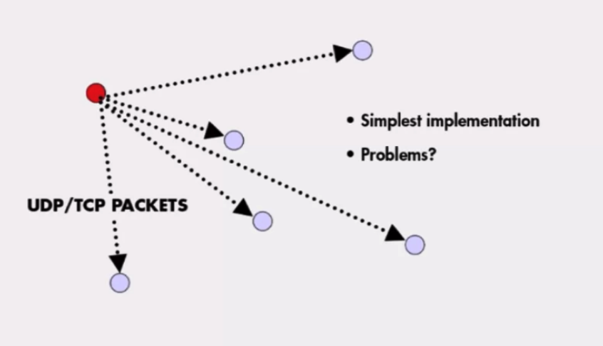

## Multicast 组播

组播是指从某一地址把信息同时传递给一组目的地址。

|||
|--|--|
|单播|点对点发消息|
|组播|某一点对一组目的发送消息|
|广播|从某一点对所有地址发送消息|

`地址`在IP层语境下，一般是指`IP地址`。在分布式系统里，一般指`进程`. 

*相对于`广播`，`组播(也叫多播)`的传输更受限制。`组播`只在一组地址(`进程`)中传播*

#### 组播的需求
云计算环境下，组播协议需要满足两个条件：`容错(fault-tolerance)`和`可拓展性(scalability)`

+ 容错(fault-tolerance): 节点故障、数据包丢失、底层网络延迟...
+ 可拓展性(scalability): 节点数量可能快速增长，而协议开销不能增长过快(慢于`O(n)`)

#### 集中式解决方案

`centralized`是最简单的解决方案。`sender`通过`for/while loop`向所有`receiver`发送信息。

但是会导致两个问题：
1. 无法容错。如果在循环中出现异常，`loop`会被中断，之后的`receiver`将不会收到消息
2. 开销高。`receiver`接收消息的平均时间为`O(n)`，网络延迟高

#### 基于树的解决方案

为了解决上述两个问题，于是有了`tree-based`方案
(e.g. IP组播, SRM, RMTP, TRAM, TMTP)

如果树足够平衡，那么树的高度应该是`O(log n)`, 并且子节点为常数。
对于云来说，故障是常态，所以树需要额外的固定开销来持续维护/修复树。

通常会在多播组之间生成树，并使用**生成树算法**来传播组播消息。随后再用`ACK(acknowledgments)`或`NAK(negative acknowledgments)`来修复失败的组播

#### SRM(Scalable Reliable Multicast)
+ 使用`NAK`：
  + 如果一个节点一段时间没有收到组播消息，那么它会向`root`方向(父节点)发送修复请求。当另一个节点收到修复请求，它会重发所需的组播消息
+ `NAK/ACK`风暴: 当网络不稳定时，整个网络中可能瞬间充满大量的`NAK/ACK`信息。为了避免`NAK`风暴
  + 随机延迟一段时间发送请求
  + 使用`exponential backoff`：每次请求的间隔为上一次时长的两倍

#### RMTP(Relicable Multicast Transport Protocol)
+ 使用`ACK`
+ `recevier`定期向`sender`发送一个**信息摘要**`(digest)`。如果`sender`发现`recevier`缺少信息，就会重新发送一份数据
+ 为了避免`ACK`风暴，只有一部分节点会被指定`(designated receiver)`。这部分节点会负责转发缺失的组播消息

*然而，这些协议依然会造成`O(n)`的`ACK/NAK`开销*