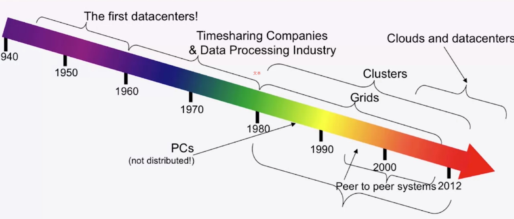

## 云计算的历史

**cloud history of time**
|Time|代表| description|
|--|--|--|
|上世纪40年代至50年代|早期建造的计算机（ENIAC, ORDVAC, ILLIAC...）|占据了整栋大厂房或实验室|
|20世纪的60年代和70年代|分时系统和数据处理（标准的穿孔卡片）|大批量的数据处理(KB/MB级别)|
|1980年代|个人电脑|网格计算概念|
|1990到2000年之间|大规模系统|P2P（点对点）系统|
| 现在|大规模集群|分时系统和海量数据处理|

