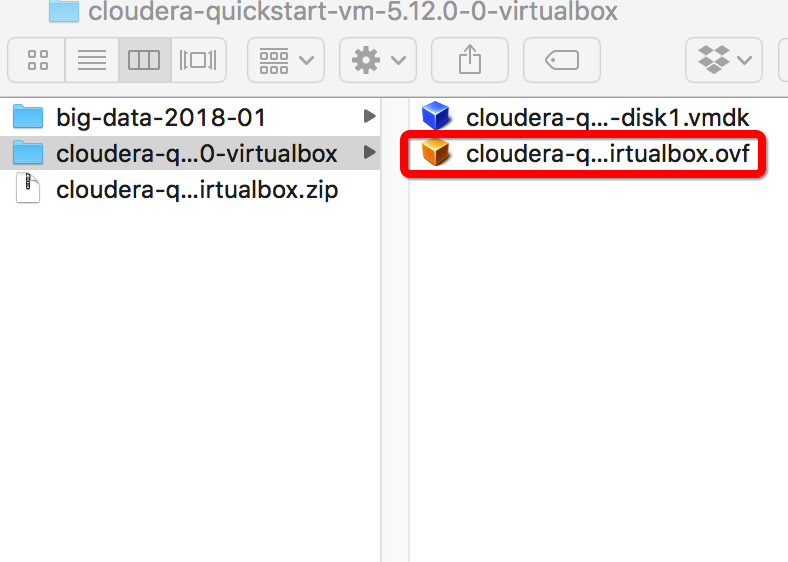
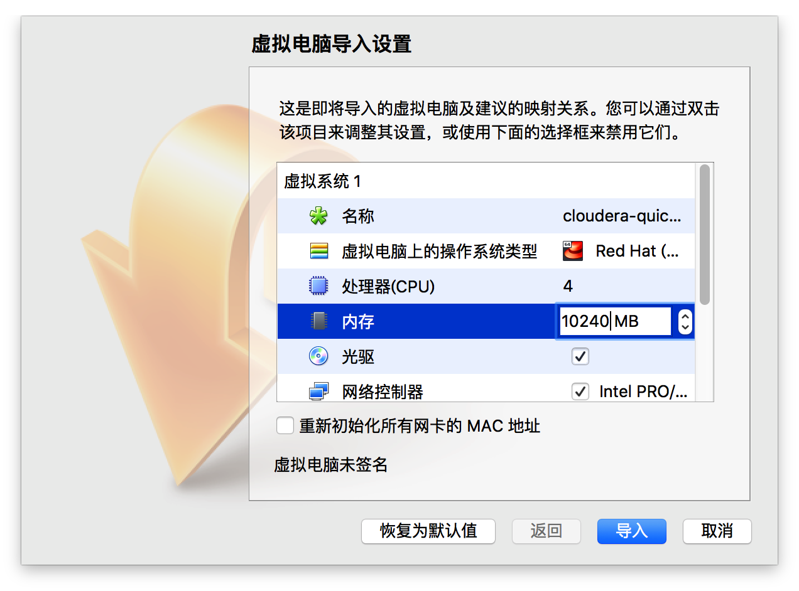
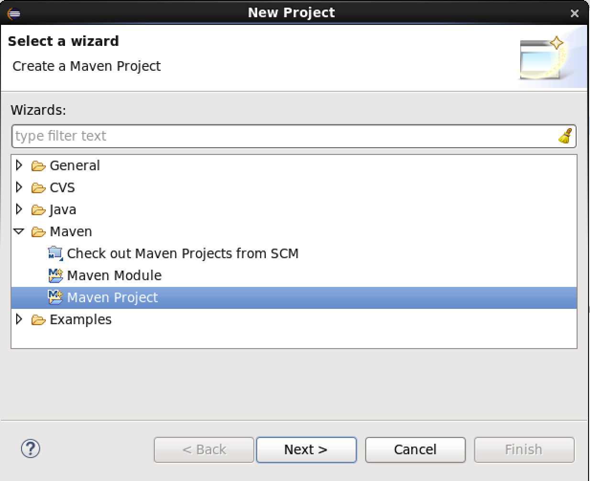
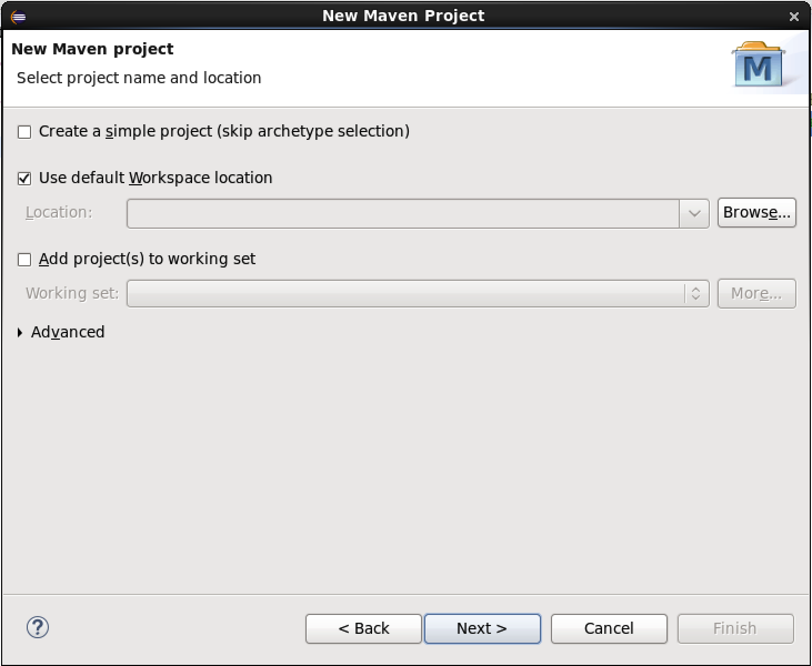
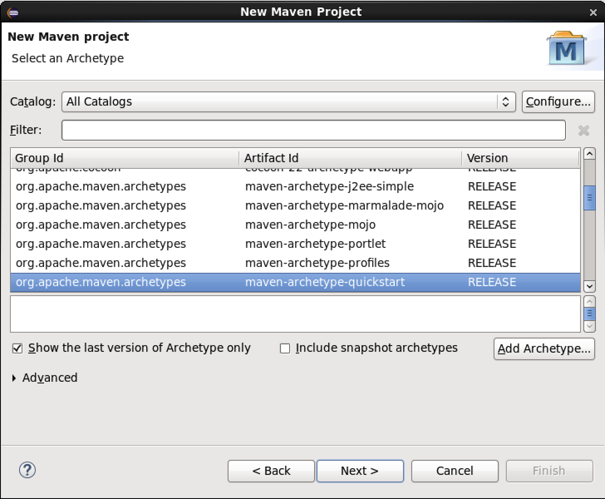
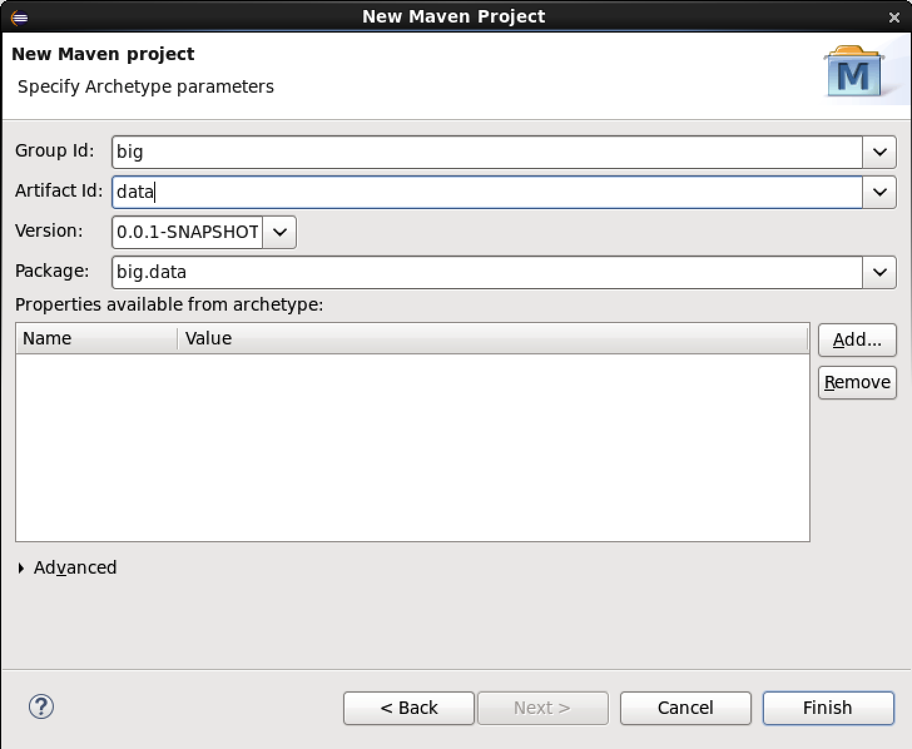
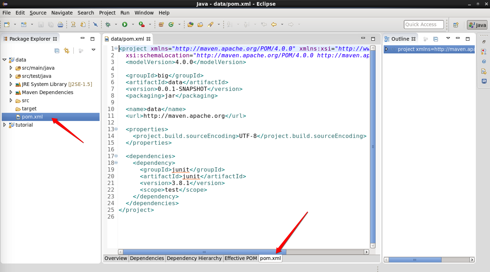
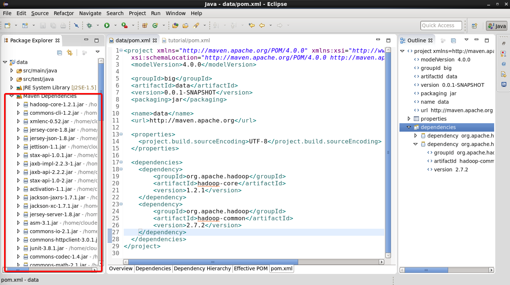
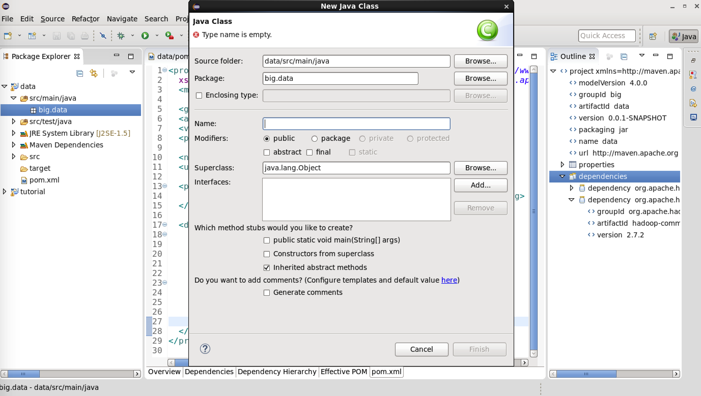
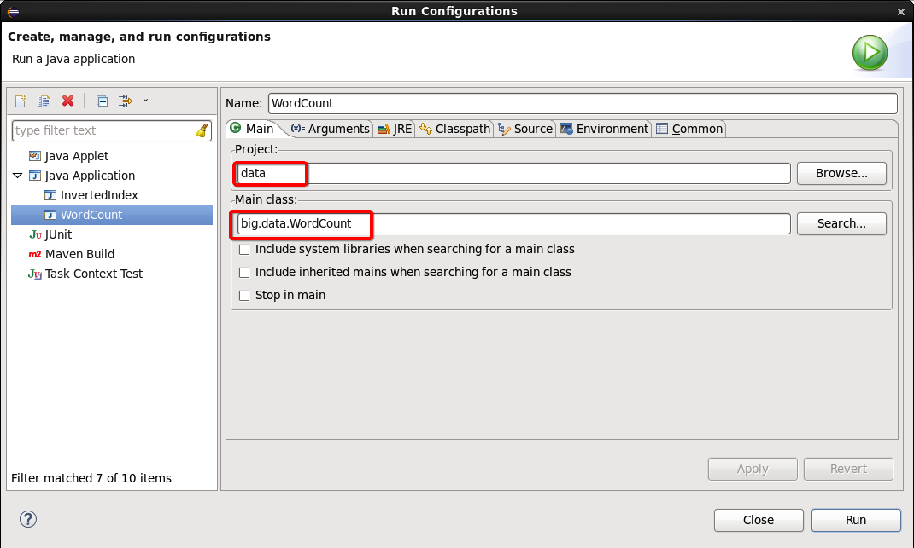

## Word Count

#### 实验准备
环境：CDH 5.13.0 镜像，虚拟机 

[VMware版](https://downloads.cloudera.com/demo_vm/vmware/cloudera-quickstart-vm-5.13.0-0-vmware.zip)

[VirtualBox版](https://downloads.cloudera.com/demo_vm/virtualbox/cloudera-quickstart-vm-5.13.0-0-virtualbox.zip)

下载对应版本的虚拟机和镜像。如果没有开启`VT-d`, 需要进入`BIOS`开启。

#### 导入虚拟机
1. 解压下载好的镜像, 点击ovf文件
2. 最低配置为6GB内存，2CPU
3. 导入镜像，开机。系统的性能此过程可能持续5~30分钟
4. 开机完成会自动打开Firefox浏览器

#### 启动Eclipse
1. 打开`eclipse`，新建`Project`, 选择`Maven Project`
2. 点击`Next`
3. `Group Id`和`Artifact Id` 随意填写，点击`Finish`，创建项目
4. 在新建的项目中，修改`pom.xml`
5. 在`pom.xml`中添加`dependency`
```xml
<dependency>
  <groupId>org.apache.hadoop</groupId>
  <artifactId>hadoop-core</artifactId>
  <version>1.2.1</version>
</dependency>
<dependency>
  <groupId>org.apache.hadoop</groupId>
  <artifactId>hadoop-common</artifactId>
  <version>2.7.2</version>
</dependency>
```
6. **保存**之后`Maven`将自动引入依赖文件
7. 从`src`中删除自动生成的`App.java`文件，新建`MapReduce`程序

#### 代码
在项目目录下新建`input/`文件夹，在该文件夹下新建`data.txt`文件。`data.txt`写入输入样本，如：
```
I love big data and hadoop and I love data science
```
在`src/main/java`文件夹下，新建`WordCount.java`
```java
package big.data;
import java.io.IOException;
import java.util.StringTokenizer;

import org.apache.hadoop.conf.Configuration;
import org.apache.hadoop.fs.Path;
import org.apache.hadoop.io.IntWritable;
import org.apache.hadoop.io.Text;
import org.apache.hadoop.mapreduce.Job;
import org.apache.hadoop.mapreduce.Mapper;
import org.apache.hadoop.mapreduce.Reducer;
import org.apache.hadoop.mapreduce.lib.input.FileInputFormat;
import org.apache.hadoop.mapreduce.lib.output.FileOutputFormat;

public class WordCount {

	public static class TokenizerMapper extends Mapper<Object, Text, Text, IntWritable> {

		public void map(Object key, Text value, Context context)
				throws IOException, InterruptedException {
			StringTokenizer itr = new StringTokenizer(value.toString());
			while (itr.hasMoreTokens()) {
				context.write(new Text(itr.nextToken()), new IntWritable(1));
			}
		}
	}

	public static class IntSumReducer extends Reducer<Text, IntWritable, Text, IntWritable> {
		public void reduce(Text key, Iterable<IntWritable> values, Context context) throws IOException, InterruptedException {
			int sum = 0;
			for (IntWritable val : values) {
				sum += val.get();
			}
			context.write(key, new IntWritable(sum));
		}
	}

	public static void main(String[] args) throws Exception {
		Configuration conf = new Configuration();
		Job job = new Job(conf, "word count");
		job.setJarByClass(WordCount.class);

		job.setMapperClass(TokenizerMapper.class);
		job.setReducerClass(IntSumReducer.class);

		job.setOutputKeyClass(Text.class);
		job.setOutputValueClass(IntWritable.class);

		FileInputFormat.addInputPath(job, new Path(args[0]));
		FileOutputFormat.setOutputPath(job, new Path(args[1]));
		System.exit(job.waitForCompletion(true) ? 0 : 1);
	}
}
```

#### 执行
1. 点击`Run`按钮，修改`Configuration`，确保`Project`和`Main Class`正确
2. 修改`Argument`, 点击`Run`
3. 在`output`路径下查看输出