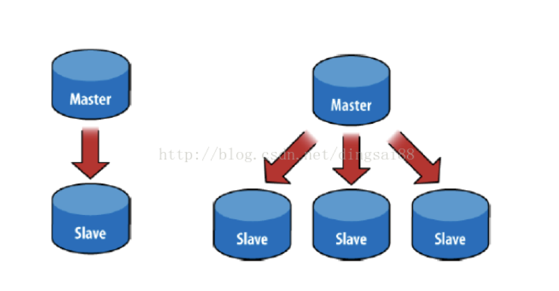
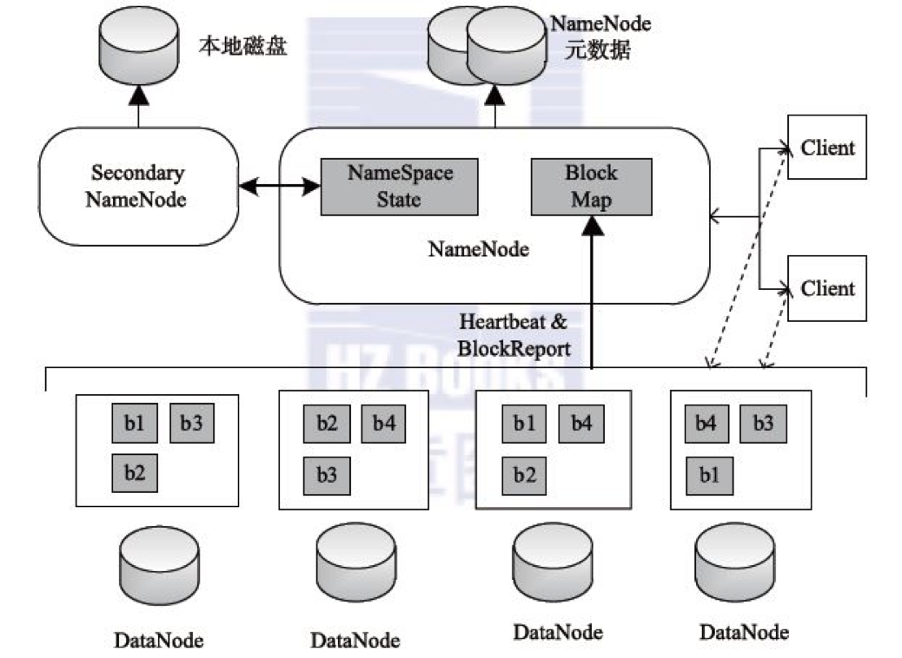
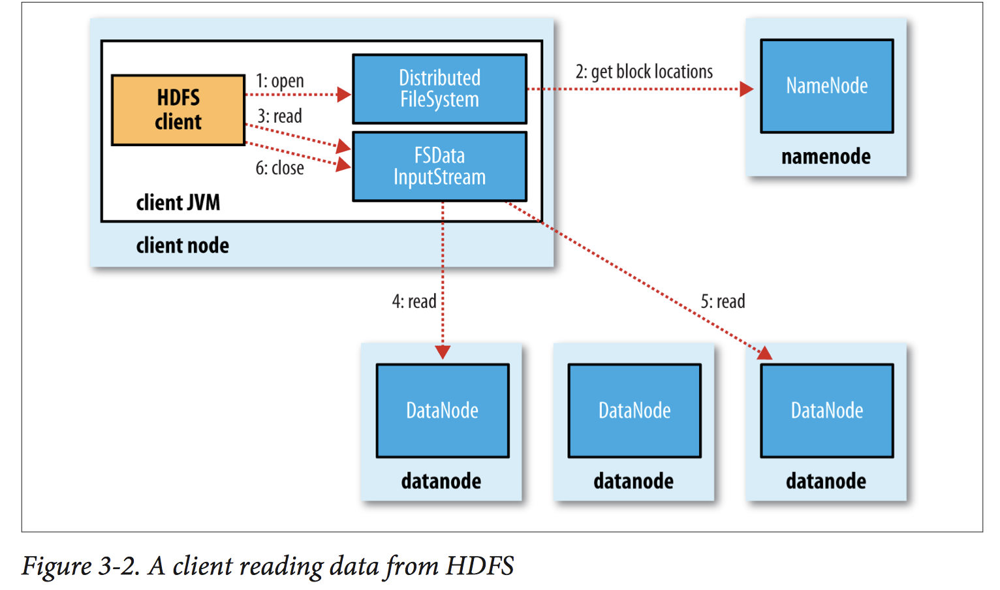
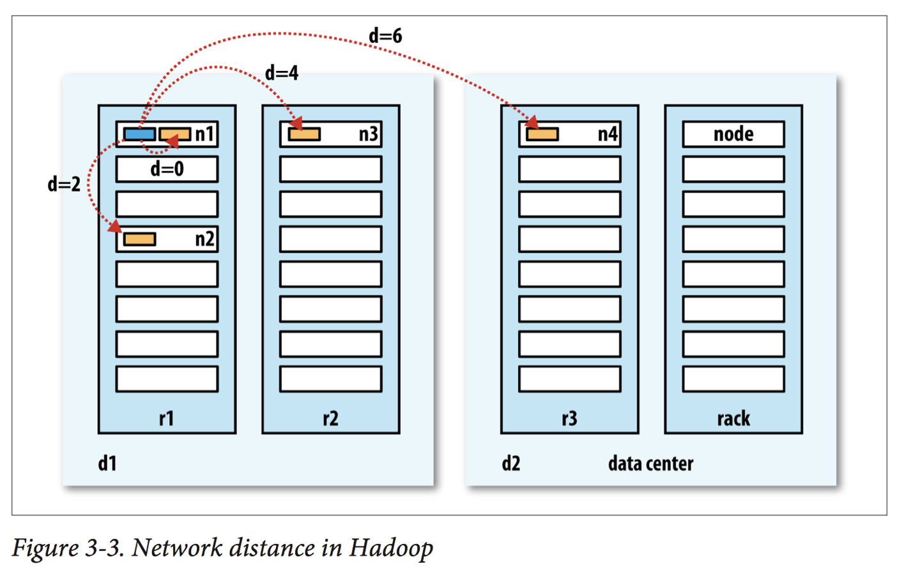
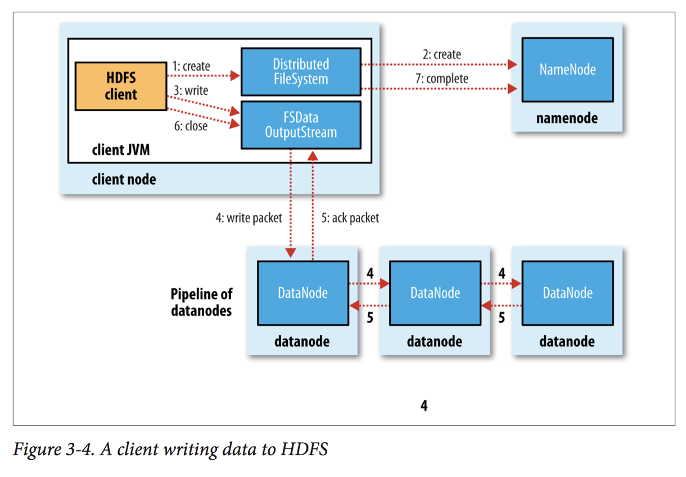
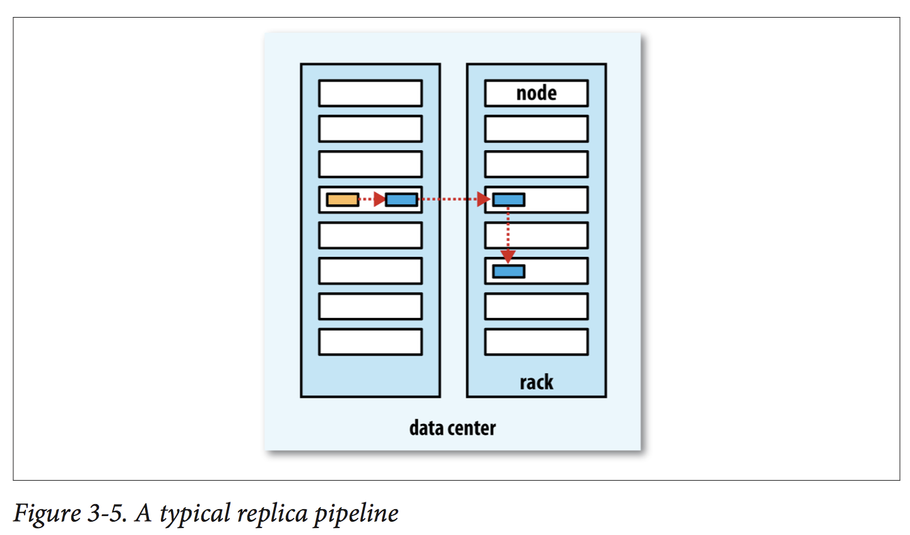

## HDFS

HDFS是Hadoop分布式文件系统的简称，特点：
1. 由若干计算机组成，尤其适合部署在廉价的机器上
2. 适合存储非常大的文件 （TB, PB, EB）
3. 每份文件可以有多个副本，所以HDFS是高容错、高冗余的文件系统

## 常见的分布式架构

|结构|描述|优势|劣势|
|--|--|--|--|
|Peer-to-Peer|N台机器相互通信，互为备份|任何结点宕机都不影响工作|机器之间经常需要通讯，保持一致性|
|Master Slave（工业界90%采用此设计）|1组机器负责管理，余下负责运算|结构简单；数据很容易保持一致|Master宕机，单点故障|




HDFS采取Master-Slave结构

## HDFS 组件


1. Client: 负责与HDFS通信
2. NameNode
    + 存放文件元数据（镜像文件fsimage + 变更日志edit_logs）
        + 整个HDFS集群只有一个NameNode，它存储整个集群文件分别的元数据信息。这些信息以fsimage和edit logs两个文件存储在本地磁盘，Client通过这些元数据信息可以找到相应的文件。
    + 记录数据块所在DataNode的信息
        + NameNode还负责监控DataNode的健康情况，一旦发现DataNode异常，就将其踢出，并拷贝其上数据至其它DataNode
3. DataNode
	+ 存储并检索数据块
        + DataNode负责数据的实际存储。当一个文件上传至HDFS集群时，它以Block为基本单位分布在各个DataNode中
        + 为了保证数据的可靠性，每个Block会同时写入多个DataNode中（默认为3）
            + Hadoop 1.x 默认Block大小为64MB
            + Hadoop 2.x 默认Block大小为128MB
	+ 向NameNode更新数据块列表（心跳）
4. Secondary NameNode
    + Secondary NameNode负责定期合并NameNode的fsimage和edit logs
    + 它不是NameNode的热备，所以NameNode依然可能造成单点故障（Single Point of Failure）

## HDFS读文件

1. client向namenode发送读数据请求
2. namenode将datanode信息发给client
3. client从datanode下载数据


HDFS会自动根据距离选取最近的数据源。距离从近到远：**同一机器 < 同一机架 < 同一数据中心 < 不同数据中心**



## HDFS写文件

1. client 向namenode 发送写数据请求
2. namenode 分块 写入datanode
3. datanode 自动完成副本备份
4. datanode 完成后向namenode汇报
5. namenode向client发送通知


数据多副本备份又datanode自行完成。一个典型的复制流程是：namenode向附近的datanode_1写入第一份数据，datanode_1自动向不同机架的datanode_2复制出第二份数据。datanode_2自动寻找可用的datanode_3, 向datanode_3复制出第三份数据。



## HDFS指令
HDFS 与Linux指令基本一致
```bash
hdfs dfs -ls /  # 列出/路径下的文件
hdfs dfs -mkdir /test  #创建/test文件夹
hdfs dfs -rm -r /test  #删除/test文件夹
hdfs dfs -put words.txt /test   #将words.txt上传到/test
hdfs dfs -ls /test  # 列出/test路径下的文件
hdfs dfs -cat /test/words.txt   #在控制台打印出/test/words.txt文件的内容
hdfs dfs -get /test/words.txt . #将/test/words.txt从HDFS下载到本地
```
