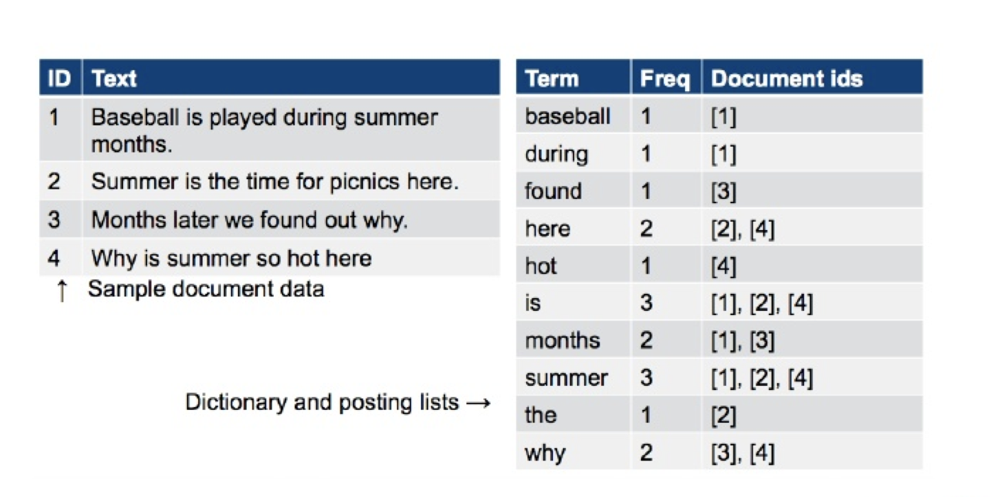
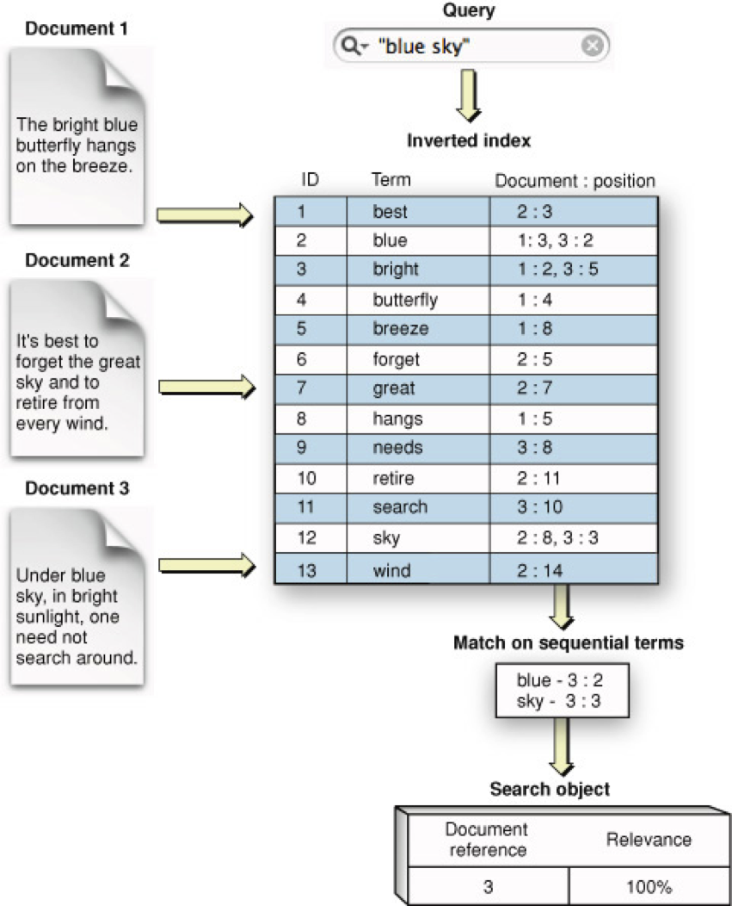

## Project 1 : Inverted Index

#### 实验准备
环境：CDH 5.13.0 (详见`5. Word Count`)

#### 创建倒排索引

倒排索引`（Inverted index）`，也常被称为反向索引、置入档案或反向档案，是一种索引方法，被用来存储在全文搜索下某个单词在一个文档或者一组文档中的存储位置的映射。

反向索引数据结构是典型的搜索引擎检索算法重要的部分，也是文档检索系统中最常用的数据结构

建立反向索引的过程分两步：
1. 对原始文档数据进行编号（DocID），形成列表。*图一左侧文档列表*
2. 对文档中数据进行分词，得到词条`(term)`。对词条进行编号，以词条为索引，保存相关信息(词频，文档编号，位置信息)。*图一右侧`posting list`*


#### 基于倒排索引的检索
首先基于`Document1`、`Document2`、`Document3`建立`Inverted Index`。假设我们要检索关键词`blue sky`. 根据`Term`分别获得对应的`posting list`:
> blue - 1:3,3:2 <br>
> sky - 2:8, 3:3

经过对比，两个关键词同时出现在`Document3`，分别位于位置`2`、`3`。于是返回`Document3`作为检索到的文档




#### 代码

```java
import java.io.IOException;
import java.util.HashMap;
import java.util.Iterator;

import org.apache.hadoop.conf.Configuration;
import org.apache.hadoop.fs.Path;
import org.apache.hadoop.io.Text;
import org.apache.hadoop.mapreduce.Job;
import org.apache.hadoop.mapreduce.Mapper;
import org.apache.hadoop.mapreduce.Reducer;
import org.apache.hadoop.mapreduce.lib.input.FileInputFormat;
import org.apache.hadoop.mapreduce.lib.input.FileSplit;
import org.apache.hadoop.mapreduce.lib.output.FileOutputFormat;

public class InvertedIndex {
	public static class Map extends Mapper<Object, Text, Text, Text> {

		public void map(Object key, Text value, Context context)
				throws IOException, InterruptedException {
			FileSplit split = (FileSplit) context.getInputSplit();
			String filePath = split.getPath().getName().toString();
			String[] words = value.toString().split("\\s+");
			for (String word : words) {
				context.write(new Text(word.toLowerCase()), new Text(filePath));
			}
		}
	}

	public static class Reduce extends Reducer<Text, Text, Text, Text> {
		public void reduce(Text key, Iterable<Text> values, Context context)
				throws IOException, InterruptedException {
			// <Word, list(file1, file1, file2, file2),...>
			HashMap<String, Integer> map = new HashMap<>();
			for (Text record : values) {
				String file = record.toString();
				int times = map.containsKey(file) ? map.get(file) : 0;
				map.put(file, times + 1);
			}

			Iterator<String> iter = map.keySet().iterator();
			String res = "";
			while (iter.hasNext()) {
				String filePath = iter.next();
				int times = map.get(filePath);
				res += filePath + ":" + times + "\t";
			}
			context.write(key, new Text(res));
		}
	}

	public static void main(String[] args) throws Exception {
		Configuration conf = new Configuration();
		Job job = new Job(conf, "inverted index");
		job.setJarByClass(InvertedIndex.class);

		job.setMapperClass(Map.class);

		job.setReducerClass(Reduce.class);

		job.setOutputKeyClass(Text.class);
		job.setOutputValueClass(Text.class);

		FileInputFormat.addInputPath(job, new Path(args[0]));
		FileOutputFormat.setOutputPath(job, new Path(args[1]));
		System.exit(job.waitForCompletion(true) ? 0 : 1);
	}
}
```

#### 执行

在项目文件夹下，创建`input/`，进入`input/`随意生成样本文档。运行上面的代码，将**输入路径**和**输出路径**，分别作为参数第一位、第二位传入。*(详见`5. Word Count`)*