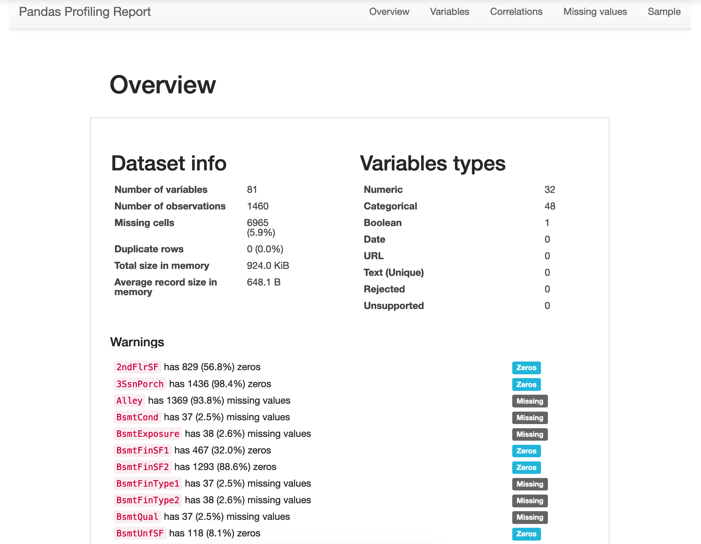
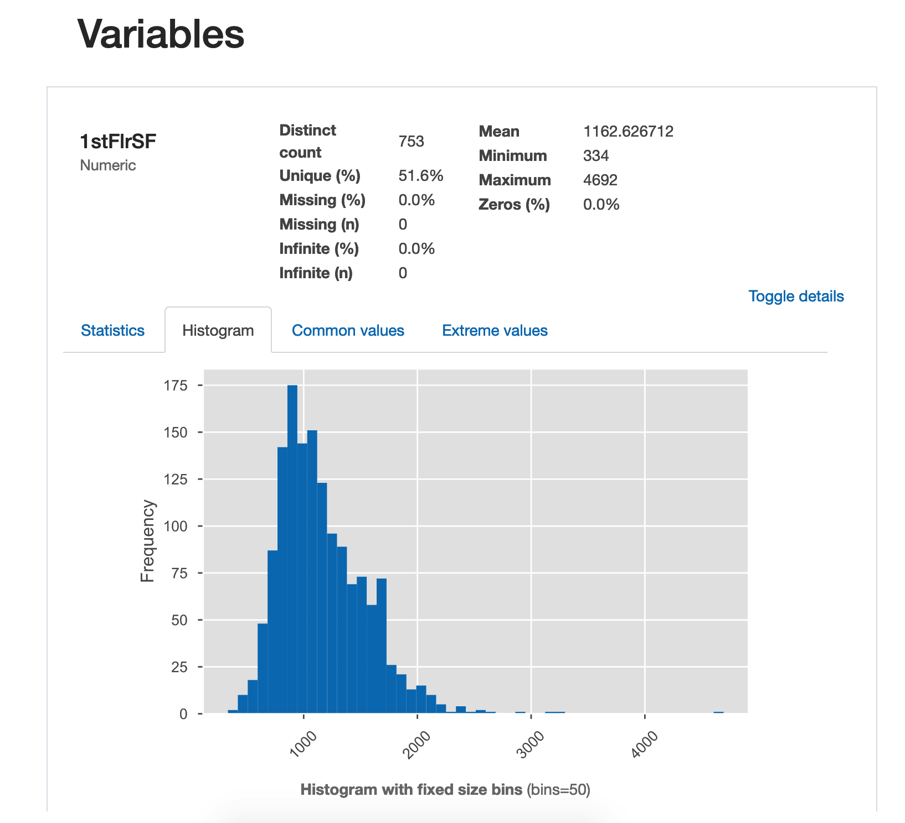
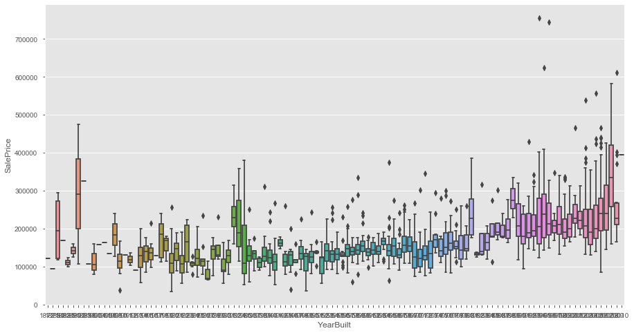
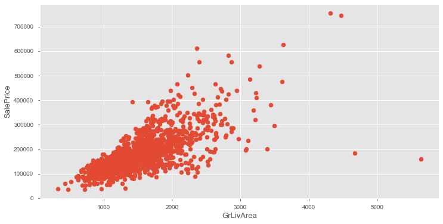

## 构建baseline

#### 数据探索

>思路：数据探索，做一点点的修改-->数据清洗(空值的填充)-->数据预处理（数据的归一化，标准化等）-->模型构建-->训练预测-->保存提交

```python
import pandas as pd
train = pd.read_csv("./train.csv")
train.head()
```

使用**pandas_profiling**完成**EDA`(explore data analysis)`**
```python
import pandas_profiling as ppf
ppf.ProfileReport(train) 
```



使用**箱型图**查看**异常值**
```python
plt.figure(figsize=(15,8))
sns.boxplot(train.YearBuilt, train.SalePrice)
```


使用**散点图**用于观察是否存在**线性关系**
```python
plt.figure(figsize=(12,6))
plt.scatter(x=train.GrLivArea, y=train.SalePrice)
plt.xlabel("GrLivArea", fontsize=13)
plt.ylabel("SalePrice", fontsize=13)
# plt.ylim(0,800000)
```

删除图中右下角有两个异常点
```python
outlier = train[(train.GrLivArea > 4000) & (train.SalePrice < 300000)]
train.drop(outlier.index, inplace=True)
```

使用
```python

```

使用
```python

```

使用
```python

```

使用
```python

```

