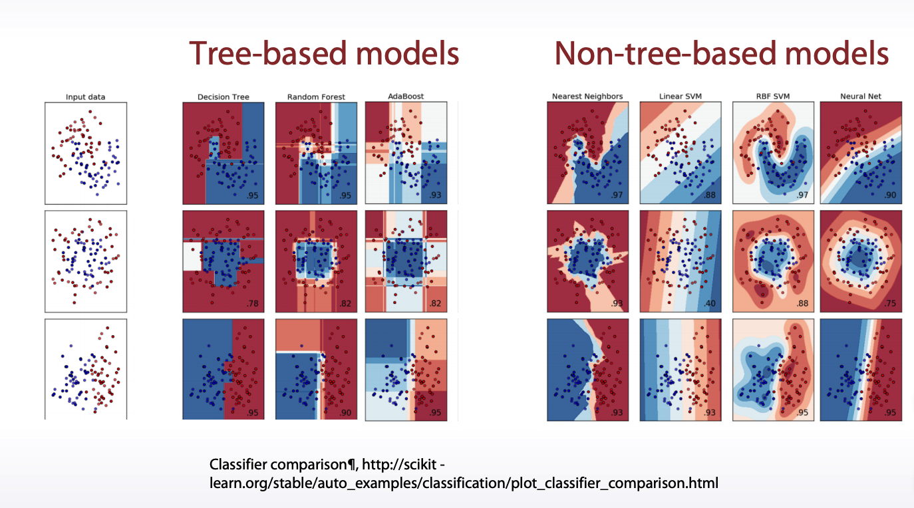
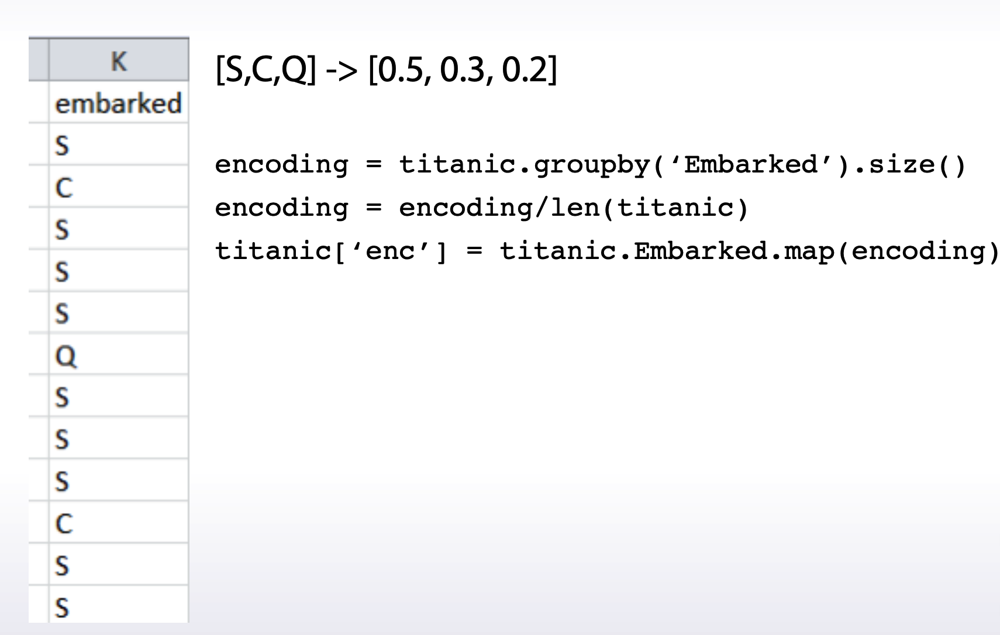
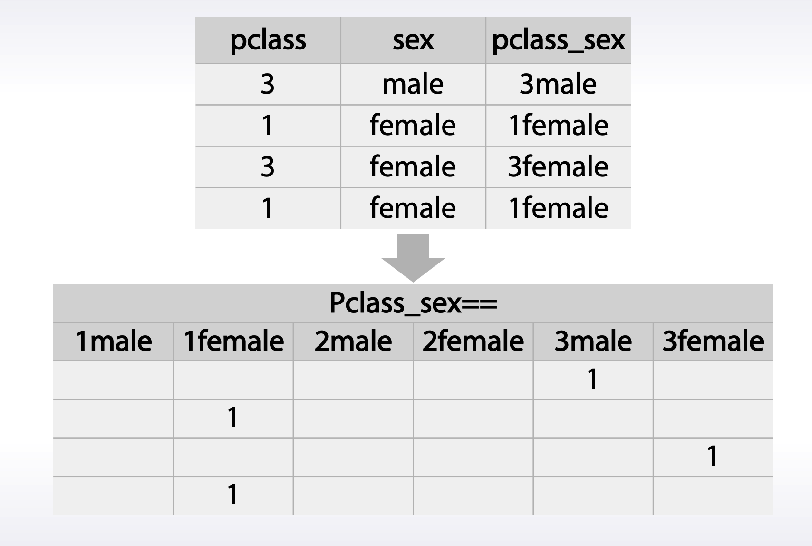
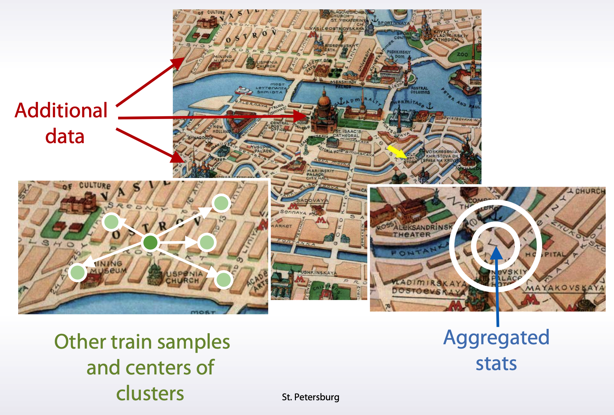
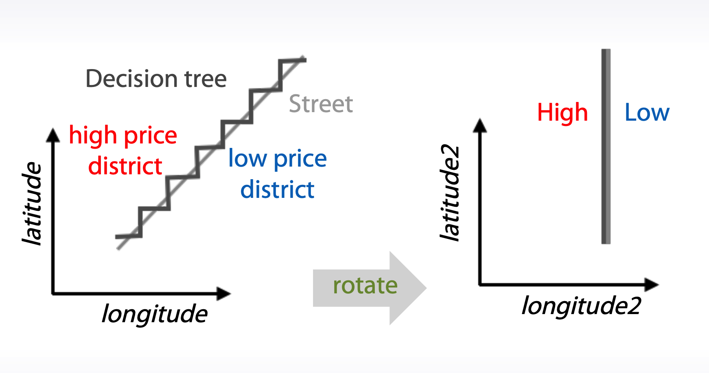

## Feature preprocessing and generation with respect to models

特征处理的技巧虽说是按套路，但是实际操作需要反复尝试。最近上的这门课程，感觉讲课水平一般，课程用的[相关文档](https://blog.csdn.net/fuqiuai/article/details/79496005)在此。但是笔记我打算用HSE University的，俄罗斯人的数学是真的强…

---

### Numeric features
1. Numeric feature preprocessing is different for tree and non-tree models:
    1. Tree-based models doesn’t depend on scaling
    2. Non-tree-based models hugely depend on scaling

2. Most often used preprocessings are:
    1. MinMaxScaler - to [0,1]
    2. StandardScaler - to mean==0, std==1
    3. Rank - sets spaces between sorted values to be equal
    4. np.log(1+x) and np.sqrt(1+x)

3. Feature generation is powered by:
    1. Prior knowledge
    2. Exploratory data analysis

### Categorical and ordinal features

1. Values in ordinal features are sorted in some meaningful
order
2. Label encoding maps categories to numbers
3. Frequency encoding maps categories to their frequencies

4. Label and Frequency encodings are often used for treebased models
5. One-hot encoding is often used for non-tree-based models
6. Interactions of categorical features can help linear models and KNN

### Datetime 

1. Periodicity
    + Day number in week, month, season, year, second, minute, hour.
2. Time since
    1. Row-independent moment
       + For example: since 00:00:00 UTC, 1 January 1970;
    1. Row-dependent important moment
       + Number of days left until next holidays/ time passed after last holiday.
3. Difference between dates
    + datetime_feature_1 - datetime_feature_2

### Coordinates

1. Additional data  
+ 插入额外数据。比如原始数据包含了某个房子的地理位置，我们额外插入医院、学校、购物中心、地铁站的位置，并算出距离

2. Interesting places from train/test data  
+ 如果没有额外数据，那么在原始数据集里，寻找interesting place。
+ 比如将地图划分成网格，在每个网格里找到最昂贵的房子，计算余下房屋与该点的距离。(虽然没有明确医院学校等信息，但是最贵的房子肯定跟某个因素有关，就用该点来近似代替)
+ 相似但是相反，找到最旧的房子

3. Centers of clusters  
+ 类似于上一条，不同于画网格，直接使用聚类

4. Aggregated statistics  
+ 选取一片房屋，算平均房产价格，代表该片区域的popularity (比如学区房)

5. Rotate 旋转地图坐标

