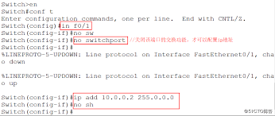
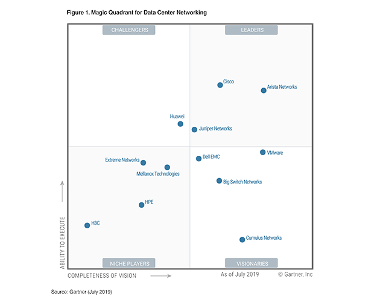
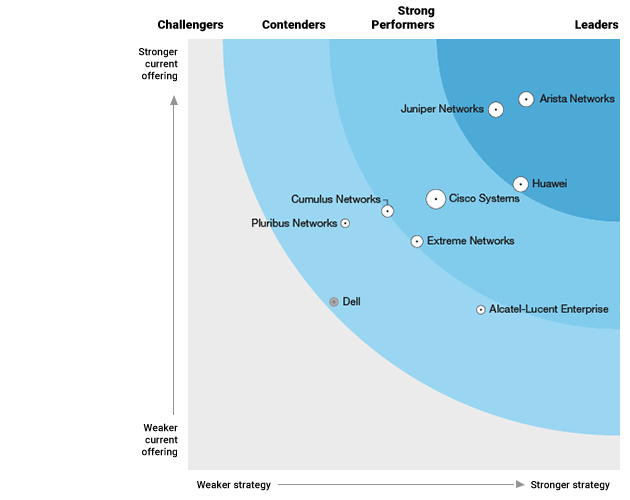

## Software Defined Network

#### 什么是SDN

`SDN`有两个基本特征：
1. 分离数据平面和控制平面
2. 进行统一的网络行为管理

**Control Plane** 控制平面在逻辑上控制转发行为，比如路由协议, 网络中间设备（middlebox: NAT, 负载均衡，firewall, IDS, etc.） 
**Data Plane** 数据平面负责根据控制平面的逻辑转发流量。比如IP层转发，2层交换

#### SDN的优势

传统路由交换设备的控制器、软硬件是捆绑销售，购买路由器的同时也购买了捆绑的软件包。这种做法有个明显的问题：功能更新缓慢，至少以年为周期。SDN对此进行了分层，可以快速的更新网络服务。

所谓网络服务，是指网络设备提供的功能特性。传统路由交换设备可以理解成拥有多端口的计算机，它也需要一个操作系统。以Cisco设备为例，运行着`Cisco IOS (Cisco Internetwork Operating System)`。

*就是这种东西*

`Cisco IOS`提供多种特性，版本12.3之后各种特性的组合被打包成了特性集。从C2900到C6500，不同特性集会被提供给不同型号的产品，以交换机为例，默认都会加载`Layer 2 Base Package`, 多层交换机会加载`IP Base Package`, 核心层设备会加载`Advanced Enterprise Services Package`。

路由设备上默认加载`IP Base Package`, 此外还可加载加密、认证、防火墙、QoS等一系列网络服务。Cisco设备拥有产品号和IOS型号，不同型号代表着不同的软件包版本，比如同为`IP Base Package`，7200、7300系列路由器拥有SSH支持，但是800到3800系列就没有。7200的`Advanced IP Services`还服从政府对路由数据进行侦听的要求，因此7200的软件包比3800会贵上很多。

> *不同方向的CCIE大致可以对应上特性集的操作，路由交换方向对应`Enterprise Base (= IP Base + data link + QoS)`，安全方向对应`Advanced Security (= IP Base + Firewall + Encryption)`, 协作对应`IP VOICE (= IP Base + VoIP + VoFR)`，运营商对应`Advanced IP Services (= SP Services + Advanced Security)`，等等*

传统路由器与SDN的关系类似于车载导航仪和手机导航，二者在产品迭代和功能更新上至少有10倍的速度差距。

#### Google的网络演化

> *所有信息来源于互联网公开信息*

**B1 / B2**

B2(BackBone) 是Google早期的网络基础架构，至今仍在使用，承载production traffic(所有高优先级流量, 包括面向用户），并且连接Google Data Center很Edge Caches.

**B3**

B3 (Backend BackBone) 诞生于2008年，独立于B2，在2011年完全被B4取代。作为实验性网络，目的是验证将低优先级流量转移到专用网络的可行性。官方说法是为了应对流媒体，复制和传输流量的增加，考虑到时间很可能是因为2006年的Youtube收购带来的流量增长。

**B4**

B4 (Beyond Backend BackBone)诞生于2010年，使用至今。承载production network，连接Google数据中心，完全基于谷歌自主开发的硬件设备。

谷歌的网络设备提供商主要为：Cisco, Juniper, Arista 三家 (三家均广告上证实自己是谷歌供应商)。

|右上角三家||
|--|--|
|||

Google自B4开始使用自研设备，思路上与云基础设施相同，将数据层和控制层分离，使用大量的廉价设备负责转发，用中心控制器负责路由，以此代替高价的特制设备, 摆脱了厂商的控制。

**Andromeda**

Google Cloud的网络虚拟化平台(NV)。NF专注于网络的虚拟化，SDN则专注于控制器。根据Google Cloud公开博客，目前已经演化到Andromeda 2.1。

---

#### 参考：

[B4公开论文](https://cseweb.ucsd.edu/~vahdat/papers/b4-sigcomm13.pdf)

[Andromeda公开论文和演讲](https://www.usenix.org/conference/nsdi18/presentation/dalton)

[GCP博客介绍Andromeda性能](https://cloud.google.com/blog/products/gcp/andromeda-2-1-reduces-gcps-intra-zone-latency-by-40-percent)
